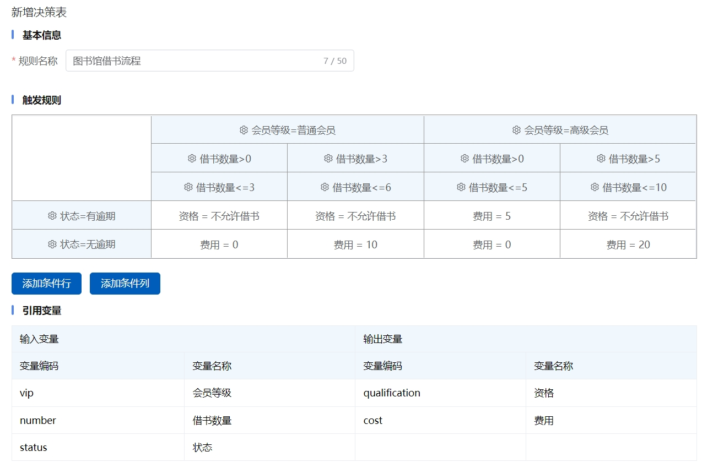
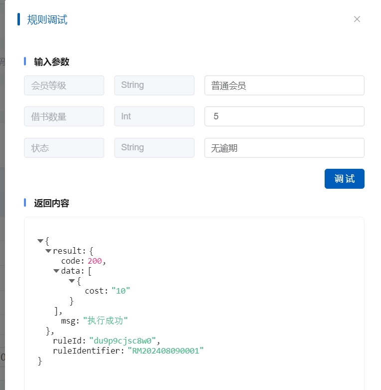

# 2.3 Decision Table

### Overview

A decision table presents and defines complex business rules in a tabular format, organizing conditions and actions into rows and columns for clearer and more efficient rule creation, modification, and management. By using a decision table, users can quickly understand and apply business logic, enhancing the accuracy and consistency of decision-making.

### How to Create a Decision Table

#### Step 1: Define the Decision Table

* **Name the Decision Table**: Assign a meaningful name to the decision table for easy identification and management.
* **Describe the Decision Table**: Provide a brief description of the decision table, explaining its purpose and intended use.

#### Step 2: Add Conditions and Actions

* **Define Conditions**: Add conditions to the input condition cells of the decision table, with each condition corresponding to a judgment point of the business rule.
* **Define Actions**: Add actions to the output action cells of the decision table, with each action corresponding to the operation the system should perform when the condition is met.

#### Step 3: Configure Rules

* **Set Condition Values**: Set specific condition values in the input condition cells of the decision table.
* **Set Action Values**: Set specific action values in the output action cells of the decision table.

#### Step 4: Test the Decision Table

* **Simulate Testing**: Test the decision table's effectiveness and performance using simulated data to ensure the rules work as expected.
* **Debug Rules**: Adjust conditions and actions based on test results to ensure the accuracy of the decision table.

#### Step 5: Deploy the Decision Table

* **Publish the Decision Table**: Deploy the tested decision table to the production environment to make it effective.
* **Monitor the Decision Table**: Monitor the execution of the decision table during its operation to ensure the smooth flow of business processes.

### Relevant Cases

#### Case 1: Library Book Borrowing Process

#### Decision Table

| Condition 1: Member Type | Condition 2: Number of Books | Condition 3: Overdue Status | Action: Allow Borrowing | Action: Borrowing Fee |
| ------------------------ | ---------------------------- | --------------------------- | ----------------------- | --------------------- |
| Regular Member           | 1-3 books                    | No Overdue                  | Allow                   | Free                  |
| Regular Member           | 1-3 books                    | Overdue                     | Not Allow               | 0                     |
| Regular Member           | 4-6 books                    | No Overdue                  | Allow                   | 10 Yuan               |
| Regular Member           | 4-6 books                    | Overdue                     | Not Allow               | 0                     |
| Premium Member           | 1-5 books                    | No Overdue                  | Allow                   | Free                  |
| Premium Member           | 1-5 books                    | Overdue                     | Allow                   | 5 Yuan                |
| Premium Member           | 6-10 books                   | No Overdue                  | Allow                   | 20 Yuan               |
| Premium Member           | 6-10 books                   | Overdue                     | Not Allow               | 0                     |

#### Rule Explanation

1. **Regular Member**:
   * If borrowing 1-3 books and no overdue, allow borrowing and free.
   * If borrowing 1-3 books and overdue, not allow borrowing.
   * If borrowing 4-6 books and no overdue, allow borrowing and fee is 10 Yuan.
   * If borrowing 4-6 books and overdue, not allow borrowing.
2. **Premium Member**:
   * If borrowing 1-5 books and no overdue, allow borrowing and free.
   * If borrowing 1-5 books and overdue, allow borrowing and fee is 5 Yuan.
   * If borrowing 6-10 books and no overdue, allow borrowing and fee is 20 Yuan.
   * If borrowing 6-10 books and overdue, not allow borrowing.

#### Rule Screenshot

<figure><figcaption></figcaption></figure>

#### Debugging Screenshot

<figure><figcaption></figcaption></figure>

This rule demonstrates how to use a decision table to manage a complex book borrowing process, considering member type, number of books, and overdue status, and deciding whether to allow borrowing and the corresponding fee based on these conditions.

Through the above case, it is evident that decision tables play a significant role in automating business processes. The creation and management of decision tables are key to the rule engine's ability to achieve efficient and flexible business decision-making.
