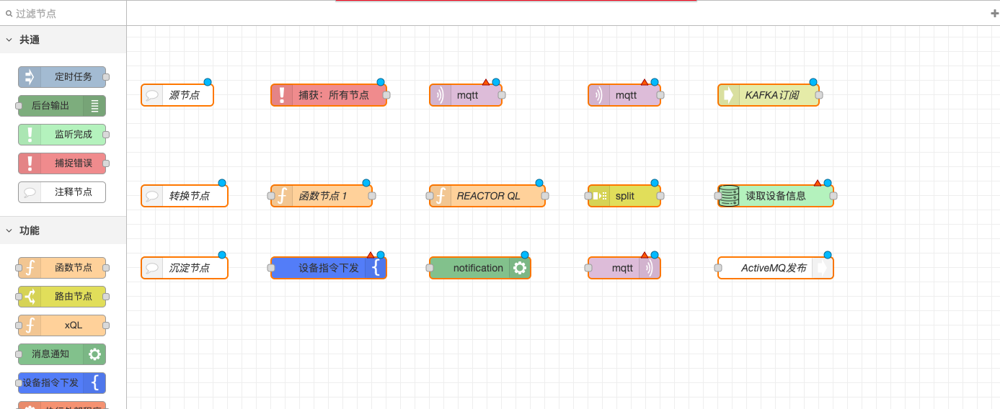

# 2.5.1 Basic Principles

### Overview

This feature aims to provide an efficient and flexible data flow management platform, enabling users to create, manage, and deploy data processing flows through Node-RED. It is particularly suitable for scenarios requiring real-time data processing and multi-channel output, such as IoT data analysis and real-time monitoring systems.

### Key Features

#### **Diverse Node Types:**

* **Source Nodes**: Responsible for data collection and output, with no input ports, such as Kafka and MQTT subscription nodes.
* **Transformation Nodes**: Handle data processing and transformation, with both input and output ports.
* **Sink Nodes**: Responsible for data storage and output, with no output ports, such as database save nodes and WebSocket push nodes.

<figure><figcaption></figcaption></figure>

#### **Standardized Data Transmission:**

* Data is transmitted between nodes in JSON format, with the main data stored in the `payload` field.
* Certain source nodes (like Kafka and MQTT subscription nodes) save the message topic in the `topic` field.
* Timer task nodes and function nodes can specify the `topic` field to be passed downstream by setting the `msg.topic` field or using JavaScript code.
* Some sink nodes (like WebSocket push nodes) can modify the `topic` field of the output message.

#### **Flexible Deployment Management:**

Since data flows are long-running, the following principles should be observed when redeploying after modifying the flow:

* **Flow Stop and Deployment**: If the flow is already executing, stop it in Node-RED before deploying.
* **Deployment Timing**: It is recommended to deploy the flow in Node-RED only after modifying it; otherwise, use the start flow function in Node-RED to activate the flow.

### Scenario Examples

* **IoT Data Processing**: Collect sensor data through source nodes, process it with transformation nodes, and store or push it to clients via sink nodes.
* **Real-Time Monitoring System**: Collect monitoring data in real-time, analyze it through transformation nodes, and store or push it to the monitoring interface via sink nodes.
* **Multi-Channel Data Output**: Support outputting processed results simultaneously to databases and WebSocket clients, or pushing data simultaneously through HTTP interfaces and WebSockets.
