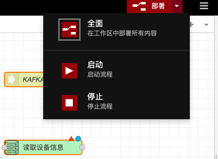
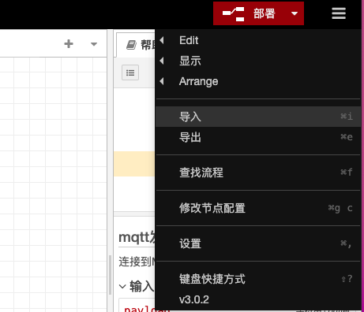
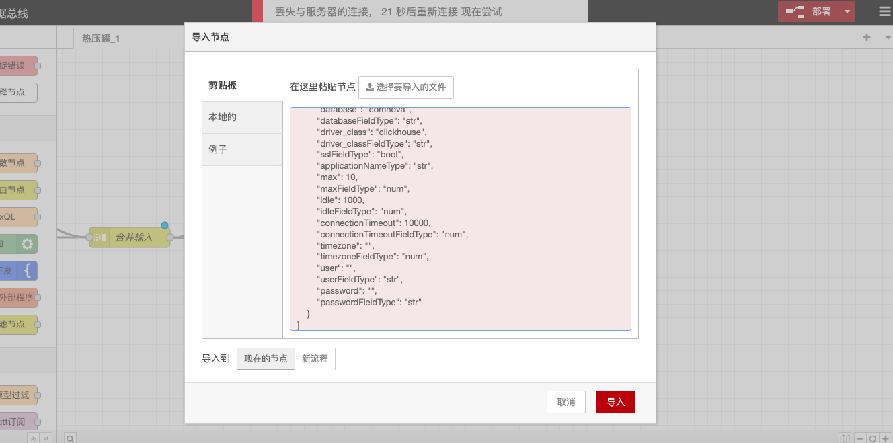

# 2.5.2 Data Flow Configuration

### Overview

The Data Flow Configuration feature is a core component of the Node-RED platform, providing a set of intuitive and powerful tools for creating, managing, and deploying data processing flows. With a graphical interface and a rich library of nodes, users can easily build complex data flows to achieve data collection, processing, transformation, and output.

### Key Features

#### **Adding Data Flows**

* Users can quickly enter the data flow configuration panel and start new data flow design by clicking the "Add Data Flow" button.

**Flow Name Configuration**

* Users can double-click the flow tab title, enter the flow name and description, to facilitate the management and identification of different data flows.

#### **Node Addition and Operations**

* Users can select nodes from the left toolbar and add them to the panel through drag-and-drop operations.
* Supports single or partial selection of nodes, as well as copy, cut, paste, and delete operations.

#### **Node Wiring**

* Users can click the connection points on the sides of nodes and drag to connect nodes, building the logical relationships of the data flow.

#### **Node Movement and Help Information Viewing**

* Users can move nodes to other positions on the panel and hover over nodes to view help information, obtaining detailed descriptions of the nodes.

#### **Flow Deployment**

* After configuring the nodes, users can click the deploy button to enable real-time operation and updates of the data flow.
* Supports pausing and redeploying the flow to ensure stable operation of the data flow.

<figure><figcaption></figcaption></figure>

#### **Import and Export of Existing Configurations**

* Users can import existing data flow files or JSON content into the canvas through the import function.
* Supports exporting the current flow as a JSON file or copying it to the clipboard for backup and sharing.

<figure><figcaption></figcaption></figure>

<figure><figcaption></figcaption></figure>
