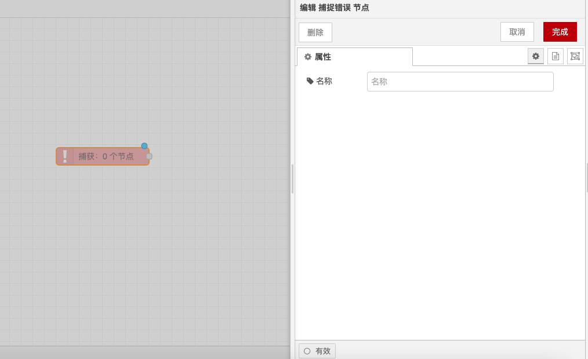

# Catch Error Node

### Function Description

The Catch Error node is used to capture errors thrown by nodes on the same tab and process them through a dedicated flow. Below is a detailed description of the functionality and configuration options:

### Output

* **error.message**: String, the error message.
* **error.source.id**: String, the ID of the node that threw the error.
* **error.source.type**: String, the type of the node that threw the error.
* **error.source.name**: String, the name of the node that threw the error (if set).

### Details

* **Error Handling**: If a node throws an error while processing a message, the flow usually stops. The Catch Error node can be used to capture these errors and process them through a dedicated flow.
* **Capture Scope**: By default, the node will catch errors thrown by any node on the same tab. Alternatively, it can be targeted at specific nodes, or configured to only catch errors that have not been caught by another "target" catch node.
* **Error Propagation**: When an error occurs, all matching catch nodes will receive the error message.
* **Subflow Error Handling**: If an error is sent within a subflow, the error will be handled by any catch node within the subflow. If there is no catch node within the subflow, the error will be propagated to the tab where the subflow instance is located.
* **Error Attributes**: If the message already has an `error` attribute, that `error` will be copied as `_error`.

With the above configurations, you can capture and handle errors thrown by other nodes in Node-RED, ensuring the stability and reliability of your flows.

<figure><figcaption></figcaption></figure>
