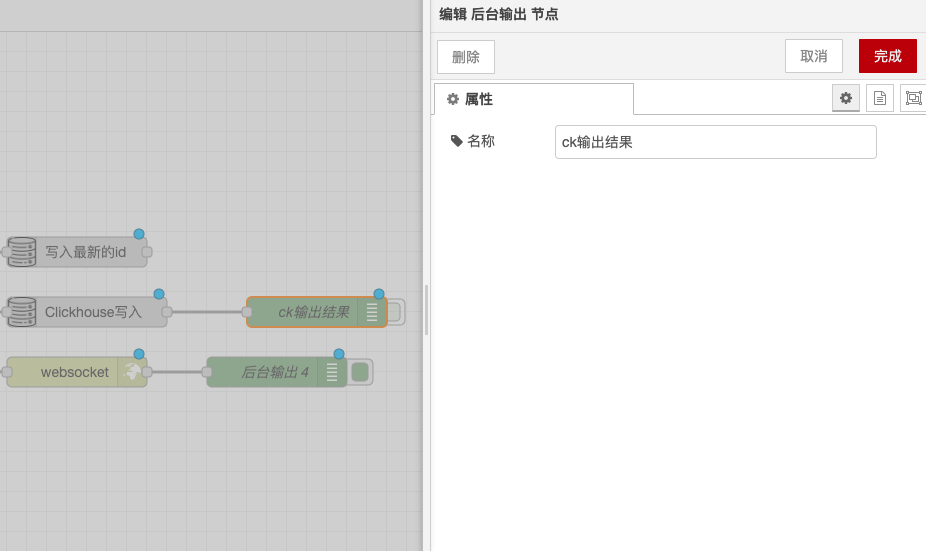

# Debug Node

### Function Description

The Debug node is used to display selected message properties in the "Debug" sidebar tab and the runtime log. Below is a detailed description of the functionality and configuration options:

### Output

* **Default Output**: By default, the value of `msg.payload` is displayed.
* **Custom Output**: You can set it to display any property, the entire message, or the result of a JSONata expression.

### Details

* **Debug Sidebar**: The Debug sidebar provides a structured view of the sent messages, making it easy to query the structure of the messages.
* **Objects and Arrays**: JavaScript objects and arrays can be collapsed or expanded as needed.
* **Buffer Objects**: Buffer objects can be displayed as raw data or as strings.
* **Message Information**: For any message, the Debug sidebar also displays information such as the time the message was received, the node that sent the message, and the message type. Clicking the source node ID will display that node in the workspace.
* **Enable/Disable Output**: The button on the node can be used to enable or disable its output. It is recommended to disable or remove all unused debug nodes.
* **Runtime Log**: You can also configure the node to send all messages to the runtime log, or to display short data (within 32 characters) in the status text below the debug node.

With the above configurations, you can use the Debug node in Node-RED to display message properties, facilitating debugging and monitoring of the message flow.

<figure><figcaption></figcaption></figure>
