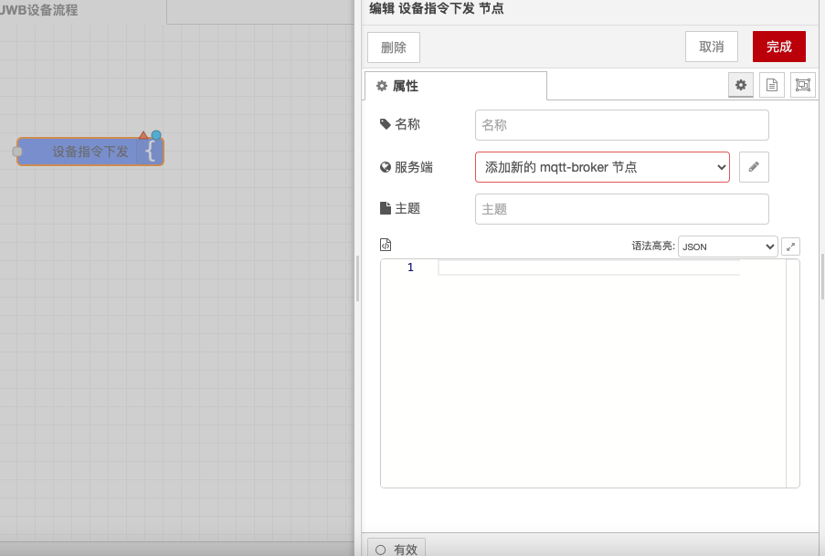
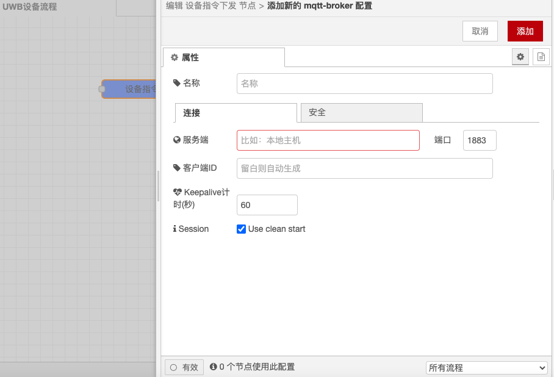

# Device Command Node

### Function Description

The Device Command Node sends commands to specified devices via the EMQX server. It allows users to specify the target device ID and define the content of the command to remotely control and manage devices.

### Configuration Options

* **Device ID**: Specifies the target device's ID to ensure the command is accurately sent to the designated device.
* **Command Content**: Defines the content of the command to be sent, which can be simple text commands or dynamic commands containing variables.

### Detailed Configuration

#### **Device ID**

* **Input**: In the node configuration, input the unique identifier (ID) of the target device. Ensure the device ID is correct to ensure the command is accurately sent to the designated device.
* **Source**: The device ID is typically provided by the device manufacturer or automatically generated during device registration.

#### **Command Content**

* **Definition**: In the node configuration, define the content of the command to be sent. Static text or dynamic variables such as `msg.payload`, `msg.topic`, etc., can be used.
* **Format**: The command content should conform to the command format supported by the device to ensure the device can correctly parse and execute the command.

### Examples

#### **Simple Command**

```json
{
  "deviceId": "device_1234",
  "command": "turn_on"
}
```

#### **Dynamic Command**

```json
{
  "deviceId": "device_1234",
  "command": "set_temperature {{msg.payload}}"
}
```

### Use Cases

* **Remote Control**: In smart home, industrial automation, and other applications, the Device Command Node is used for remote control of devices, such as turning lights on/off, adjusting temperature, etc.
* **Device Management**: In device management systems, the Device Command Node is used to send configuration updates, firmware upgrades, etc., to devices.
* **Data Collection**: In data collection applications, the Device Command Node is used to send data collection commands to devices, such as reading sensor data, performing diagnostic operations, etc.

### Notes

* **Device ID**: Ensure the device ID is correct to ensure the command is accurately sent to the designated device.
* **Command Format**: Ensure the command content conforms to the command format supported by the device to avoid the device being unable to correctly parse and execute the command.
* **Security**: When sending commands, protect the device ID and command content to avoid leaking sensitive information.

### MQTT Broker Connection Settings

In Node-RED, the connection settings for the MQTT broker can be reused in both MQTT In and MQTT Out nodes. Here are the key points for the connection settings:

* **Server Configuration**: Input the address and port of the MQTT broker server, such as `mqtt://your-mqtt-broker:1883`.
* **Client ID**: If the client ID is not set and session initialization is enabled, a random client ID will be generated. Ensure the client ID is unique at the connection target's broker.
* **Username and Password** (if required): Input the username and password used to connect to the MQTT broker server.

#### Message Types and Topics

The Device Command Node involves several message types, each associated with a specific topic:

* **Birth Message**: A message published after establishing a connection. The topic and message content can be set in the configuration. For example, set the topic to `device/birth`.
* **Close Message**: A message published before the connection ends normally, redeploys, or closes the node. The topic and message content can be set in the configuration. For example, set the topic to `device/close`.
* **Will Message**: A message published by the broker when the node loses the connection unexpectedly. The topic and message content can be set in the configuration. For example, set the topic to `device/will`.

#### WebSocket Support

If WebSocket connection is needed, the connection target's URI can be described in full format in the server field, such as `ws://example.com:4000/mqtt`.

With the above configuration, you can send commands to specified devices via the MQTT broker in Node-RED, handle various state messages of the connection, and ensure each message type is associated with the correct topic.

<figure><figcaption></figcaption></figure>

<figure><figcaption></figcaption></figure>
