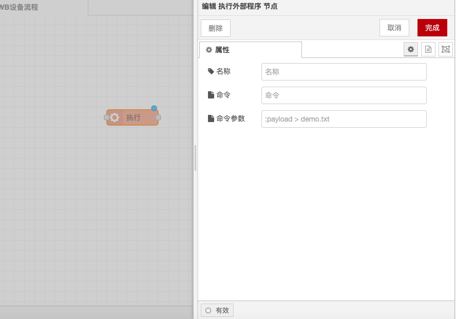

# Execute External Program Node

### Function Description

* **Run Command**: The node can run system commands and return their output.
* **Wait Mode**: The node can be configured to wait for the command to complete or send its output as the command generates it.
* **Command Source**: The command to be run can be configured in the node or provided by the incoming message.

### Input

* **payload**: String, if configured this way, will be appended to the command to be executed.
* **kill**: String, specifies the type of kill signal to be sent to an existing exec node process.
* **pid**: Numeric or string, the process ID of the existing exec node process to be killed.

### Output

* **Standard Output (stdout)**:
  * **payload**: String, the standard output of the command.
  * **rcobject**: (Execution mode only) A copy of the return code object (also available on port 3).
* **Standard Error Output (stderr)**:
  * **payload**: String, the standard error output of the command.
  * **rcobject**: (Execution mode only) A copy of the return code object (also available on port 3).
* **Return Code**:
  * **payload**: Object, an object containing the return code along with message and signal properties.

### Details

* **Default Behavior**: By default, the command is invoked using the exec system call, waits for the command to complete, and then returns the output. The return code for a successful command should be `{code: 0}`.
* **Spawn Mode**: (Optional) It is possible to choose to use spawn instead, which returns output from stdout and stderr as the command runs, typically one line at a time. Upon completion, it returns an object on the third port. A successful command should return `{code: 0}`.
* **Error Handling**: Errors may return additional information on the third port `msg.payload`, such as a message string, signal string.
* **Command Definition**: The command to be run is defined within the node, with the option to append `msg.payload` and an additional set of arguments. Commands or arguments with spaces should be quoted: "This is a parameter".
* **Output Type**: The returned payload is typically of string type unless non-UTF8 characters are detected, in which case it will be of buffer type.
* **Status Icon**: When the node is active, the status icon and PID of the node will be visible. Changes to this can be read via the Status node.
* **Kill Process**: Sending `msg.kill` will kill an active process. `msg.kill` should be a string containing the type of signal to send, such as `SIGINT`, `SIGQUIT`, or `SIGHUP`. If set to an empty string, it defaults to `SIGTERM`. If the node has multiple processes running, `msg.pid` must also be set with the value of the PID to be killed.
* **Timeout Setting**: If a timeout field is provided with a value, the process will be automatically terminated if it has not completed after the specified number of seconds.
* **Tip**: If running a Python application, you may need to use the `-u` parameter to stop output buffering.

With the above configurations, you can use the Execute External Program node in Node-RED to run system commands and handle their outputs.

<figure><figcaption></figcaption></figure>
