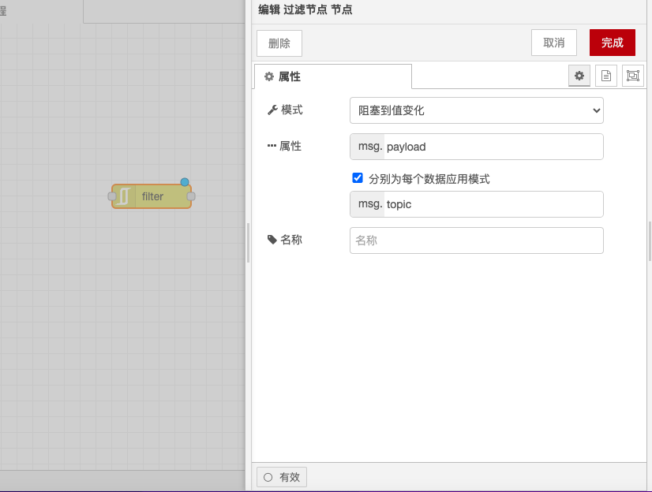

# Filter Node

### Function Description

* **RBE Mode**: Passes messages only when the payload (or selected property) value differs from the previous value. The initial value can be ignored if needed, to prevent any messages from being sent at startup.
* **Deadband Mode**: Passes messages only when the input value changes by more than or equal to ± the band gap.
* **Narrowband Mode**: Passes messages only when the input value changes by less than or equal to ± the band gap. This is useful for ignoring outlier values produced by faulty sensors.

### Input

* **payload**: Numeric, string, or simple object. RBE mode accepts these types, while other modes must provide a resolvable numeric value.
* **topic**: String, if specified, the function will operate based on each topic. This property can be set via configuration.
* **reset**: If set, it will clear the stored value for the specified `msg.topic`, or for all topics if `msg.topic` is not specified.

### Output

* **payload**: Same as input. If triggered, the output will be the same as the input.

### Details

* **RBE Mode**: In RBE mode, the node will block messages until the `msg.payload` (or selected property) value differs from the previous value. The initial value can be ignored if needed, to prevent any messages from being sent at startup.
* **Deadband Mode**: In Deadband mode, the node will block the input value unless its change is greater than or equal to ± the band gap.
* **Narrowband Mode**: In Narrowband mode, the node will block the input value if its change is greater than or equal to ± the band gap. This is useful for ignoring outlier values produced by faulty sensors.
* **Band Gap Support for Percentages**: In Deadband and Narrowband modes, the input value must contain a resolvable numeric value, and both support percentages—only send when the input value changes by more than x% of the original value.
* **Comparison Modes**: In Deadband and Narrowband modes, the comparison can be made against the previous valid output value, thus ignoring any out-of-range values, or against the previous input value, which resets the setpoint, allowing gradual drift (Deadband) or step changes (Narrowband).
* **Topic-Based Operation**: This node operates based on each `msg.topic`, although this can be changed to another property if needed. This means a single filter node can handle multiple different topics simultaneously.

With the above configurations, you can use the Filter node in Node-RED to filter messages based on specific conditions and process their outputs.

<figure><figcaption></figcaption></figure>
