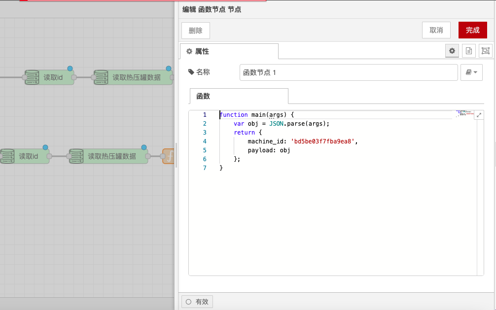

# Function Node

### **Function Description**

The Function node is used to define JavaScript code (the body of the function) that processes incoming messages. The input message is passed in a JavaScript object called `msg`, and typically the message body is retained in the `msg.payload` property. The function generally returns a message object (or multiple message objects), but it can also return nothing to stop the flow.

### **Detailed Configuration**

#### **Passing Messages:**

* To pass messages to the next node in the flow, return the message or call `node.send(messages)`.
* When returning a single message object, it is passed to the node connected to the first output.
* When returning an array of message objects, they are passed to the nodes connected to the corresponding outputs.
* If the array elements are arrays, multiple messages are sent to the corresponding outputs.
* If the return value is `null`, no messages are sent.

#### **Logging and Error Handling:**

*   Use the following functions to output log information and handle errors:

    ```javascript
    node.log("Log message");
    node.warn("Warning");
    node.error("Error");
    ```
*   Use the `catch` node for error handling. To be handled by the `catch` node, pass `msg` as the second argument to `node.error`:

    ```javascript
    node.error("Error", msg);
    ```

#### **Accessing Node Information:**

*   The following properties can be used to reference the node ID and name in the code:

    ```javascript
    node.id;   // Node's ID
    node.name; // Node's name
    ```

#### **Using Environment Variables:**

* Environment variables can be accessed via `env.get("MY_ENV_VAR")`.

### **Examples**

*   **Simple Message Processing**:

    ```javascript
    // Convert message body to uppercase
    msg.payload = msg.payload.toUpperCase();
    return msg;
    ```
*   **Multiple Outputs**:

    ```javascript
    // Send messages to two different outputs
    var msg1 = { payload: "Output 1" };
    var msg2 = { payload: "Output 2" };
    return [msg1, msg2];
    ```
*   **Error Handling**:

    ```javascript
    // Check if message body is empty, if so throw an error
    if (!msg.payload) {
      node.error("Payload is empty", msg);
    }
    return msg;
    ```
*   **Using Environment Variables**:

    ```javascript
    // Get environment variable and add it to the message
    var envVar = env.get("MY_ENV_VAR");
    msg.payload = "Environment variable: " + envVar;
    return msg;
    ```

### **Usage Scenarios**

* **Data Transformation**: In data transformation applications, the Function node is used to perform operations such as format conversion and calculations on data.
* **Conditional Judgments**: In scenarios where different processing is required based on conditions, the Function node is used to write conditional judgment logic.
* **Error Handling**: In scenarios requiring error handling and logging, the Function node is used to write error handling logic.
* **Using Environment Variables**: In scenarios where environment variables are needed, the Function node is used to access and use environment variables.

### **Notes**

* **Code Quality**: Ensure that the function code is concise and efficient, avoiding unnecessary complexity.
* **Error Handling**: Include appropriate error handling in critical logic to ensure system stability.
* **Environment Variables**: When using environment variables, ensure that they are correctly configured.

With these configuration options and functionalities, the Function node can flexibly process and manipulate messages, ensuring that the flow executes according to the predetermined logic.

<figure><figcaption></figcaption></figure>
