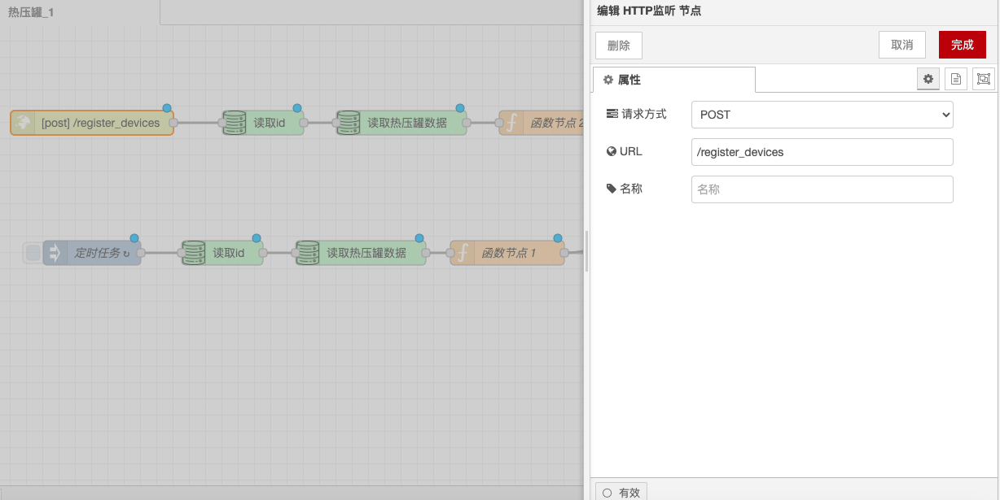

# HTTP Listener Node

### **Function Description**

The HTTP Listener node is used to listen for HTTP requests, triggering the corresponding flow when an HTTP request arrives. It can be configured with parameters such as request method, URL, headers, and handle request data.

### **Configuration Options**

* **Request Method**: Choose between GET or POST request methods.
  * **GET Request**: Used to retrieve data from the server, typically does not contain a request body.
  * **POST Request**: Used to submit data to the server, typically contains a request body.
* **URL**: Set the target address for the request, which can be an HTTP or HTTPS address.
* **Headers**: Set request headers, such as Content-Type, Authorization, etc.
  * **Content-Type**: Specifies the format of the request body, such as `application/json` or `application/x-www-form-urlencoded`.
  * **Authorization**: Used for authentication, can set Basic Auth or Bearer Token.

### **Detailed Configuration**

* **Path**: Set the path to listen on, such as `/api`.
* **Method**: Set the HTTP method to listen for, such as GET, POST, etc.
* **Response Headers**: Set response header information, such as Content-Type, Cache-Control, etc.
  * **Content-Type**: Specifies the format of the response body, such as `application/json` or `text/html`.
  * **Cache-Control**: Set the caching policy, such as `no-cache`, `max-age=3600`, etc.
* **Response Body**: Set the content of the response, which can be a string, JSON object, etc.
  * **String**: Return simple text content, such as "Hello, World!".
  * **JSON Object**: Return structured data, such as `{"message": "Success"}`.

With these configuration options and functionalities, the HTTP Listener node can flexibly handle and respond to HTTP requests, ensuring that clients can correctly send and receive data.

<figure><figcaption></figcaption></figure>

####
