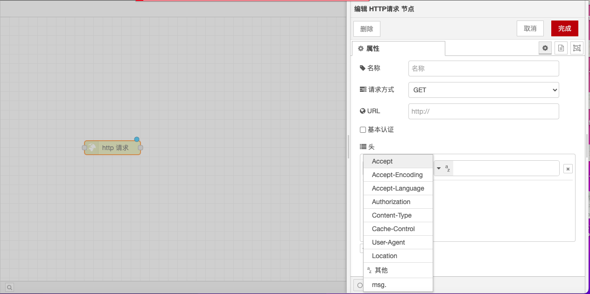

# HTTP Request Node

### **Function Description**

The HTTP Request node is used to send HTTP requests and return responses. It can be configured with parameters such as URL, request method, headers, cookies, request body, and handle response body, status code, headers, and other information.

### **Input**

* **url**: If not configured in the node, this optional property sets the URL for the request.
* **method**: If not configured in the node, this optional property sets the HTTP method for the request. It must be one of GET, PUT, POST, PATCH, or DELETE.
* **headers**: Set the HTTP headers for the request.
* **cookies**: If set, can be used to send cookies with the request.
* **payload**: Sent as the body of the request.
* **rejectUnauthorized**: If set to false, allows requests to HTTPS sites with self-signed certificates.
* **followRedirects**: If set to false, prevents following redirects (HTTP 301). Defaults to true.
* **requestTimeout**: If set to a positive number of milliseconds, it will override the globally set httpRequestTimeout parameter.

### **Output**

* **payload**: The body of the response. The node can be configured to return the body as a string, attempt to parse it as a JSON string, or leave it as a binary buffer.
* **statusCode**: The status code of the response, or the error code if the request could not be completed.
* **headers**: An object containing the response headers.
* **responseUrl**: This property is the final redirected URL if any redirects occurred during the processing of the request. Otherwise, it is the original request URL.
* **responseCookies**: If the response contains cookies, this property is an object of 'name/value' key-value pairs for each cookie.
* **redirectList**: If the request was redirected one or more times, the accumulated information will be added to this property. "location" is the next redirect target. Cookies are returned from the redirect source.

### **Details**

* **URL Configuration**: After configuring within the node, the URL property can contain mustache-style tags. These tags allow the use of incoming message values to construct the URL. For example, if the URL is set to `example.com/{{topic}}`, it will automatically insert the value of `msg.topic`. Using `{{{...}}}` can prevent mustache from escaping characters like `/ &`.
* **Query String Parameters for GET Requests**: The node can optionally automatically encode `msg.payload` as query string parameters for a GET request, in which case `msg.payload` must be an object.
* **Proxy Settings**: If a proxy is used, the `http_proxy=...` environment variable should be set and Node-RED should be restarted, or use "proxy configuration". If proxy configuration is set, it takes precedence over the environment variable.
* **Multiple HTTP Request Nodes**: To use the node multiple times in one flow, it is important to handle the `msg.headers` property. Usually, the first node sets this property in the response headers without expecting it to be used in the request headers of the next node. If the `msg.headers` property remains unchanged between nodes, the second node will ignore it. To set custom headers, `msg.headers` should first be deleted or reset to an empty object: `{}`.
* **Cookie Handling**: The cookies property passed to the node must be an object of 'name/value' key-value pairs. The value can be a string setting the cookie value or an object with a single value property. All cookies returned from the request will be passed back under the `responseCookies` property.
* **Content-Type Handling**: If `msg.payload` is an object, the node will automatically set the request content type to `application/json` and encode it. To encode the request as form data, `msg.headers["content-type"]` should be set to `application/x-www-form-urlencoded`.
*   **File Upload**: To perform a file upload, `msg.headers["content-type"]` should be set to `multipart/form-data` and `msg.payload` passed to the node must be an object with the following structure:

    ```json
    {
        "KEY": {
            "value": FILE_CONTENTS,
            "options": {
                "filename": "FILENAME"
            }
        }
    }
    ```

    The values of `KEY`, `FILE_CONTENTS`, and `FILENAME` should be set to appropriate values.

With these configuration options and functionalities, the HTTP Request node can flexibly handle and send HTTP requests, and process response data, ensuring that the flow can be triggered and executed according to the predetermined plan.

<figure><figcaption></figcaption></figure>
