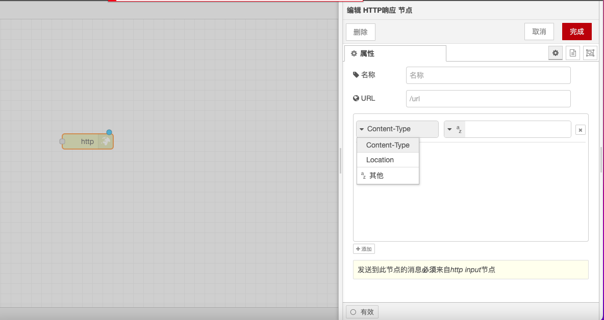

# HTTP Response Node

### **Function Description**

The HTTP Response node is used to configure HTTP responses, working in conjunction with the HTTP Listener node to ensure that processed data can be correctly returned to the client. It allows users to set the response status code, headers, and body so that the client can correctly parse and process the response.

### **Configuration Options**

* **Status Code**: Set the response status code, such as 200, 404, etc.
  * **200**: Indicates a successful request.
  * **404**: Indicates that the requested resource was not found.
  * **500**: Indicates an internal server error.
  * **Other Status Codes**: Set other status codes as needed, such as 201 (created successfully), 401 (unauthorized), etc.
* **Response Headers**: Set the response header information, such as Content-Type, Cache-Control, etc.
  * **Content-Type**: Specifies the format of the response body, such as `application/json` or `text/html`.
  * **Cache-Control**: Sets the caching policy, such as `no-cache`, `max-age=3600`, etc.
  * **Other Headers**: Set other response headers as needed, such as Authorization, Set-Cookie, etc.
* **Response Body**: Set the content of the response, which can be a string, JSON object, HTML document, etc.
  * **String**: Return simple text content, such as "Hello, World!".
  * **JSON Object**: Return structured data, such as `{"message": "Success"}`.
  * **HTML Document**: Return an HTML page, such as `<html><body><h1>Welcome</h1></body></html>`.

### **Detailed Configuration**

* **Status Code**:
  * The status code can be dynamically set based on the result of the request processing, for example, returning 200 upon successful processing, and 400 or 500 upon failure.
* **Response Headers**:
  *   Multiple response headers can be set, each header information exists in the form of key-value pairs. For example:

      ```json
      {
        "Content-Type": "application/json",
        "Cache-Control": "no-cache"
      }
      ```
* **Response Body**:
  * The content of the response body can be dynamically generated based on the result of the request processing. For example, return a JSON object containing the processing result upon success, and a JSON object containing the error information upon failure.

With these configuration options and functionalities, the HTTP Response node can flexibly handle and return HTTP responses, ensuring that the client can correctly parse and process the response data.

<figure><figcaption></figcaption></figure>
