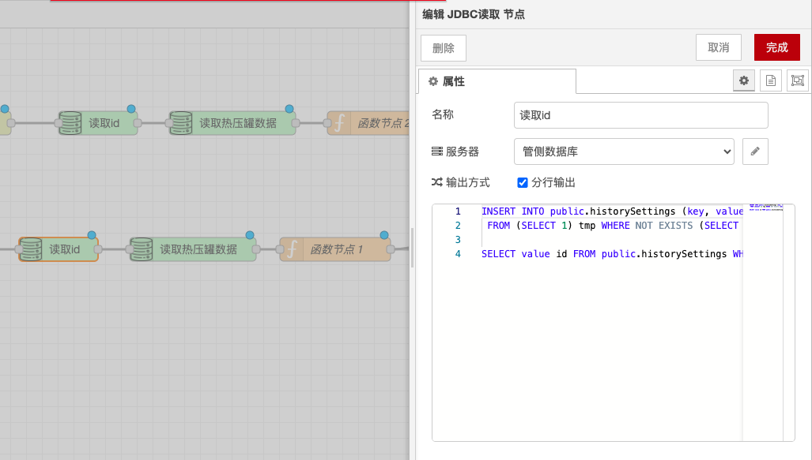
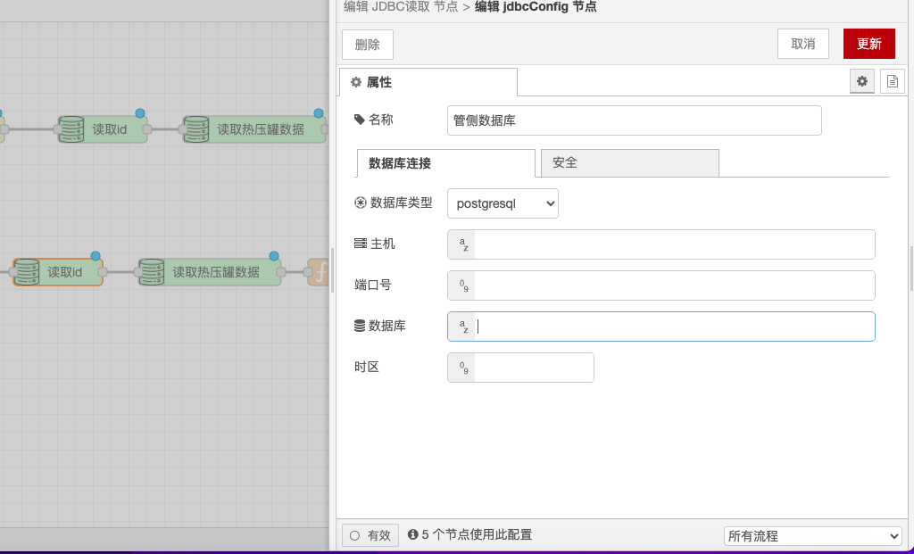

# JDBC Read and Write Nodes

### **Function Description**

* **JDBC Read Node**: Used to read data from the database and convert it to JSON format. It allows users to configure SQL query statements to retrieve data from the database and convert the results to JSON format for further processing.
* **JDBC Write Node**: Used to write JSON data into the database. It allows users to configure SQL insert or update statements to write JSON data into the database.

### **Configuration Options**

* **Database Connection Information**: Includes hostname, port, database name, username, and password.
  * **Hostname**: The hostname or IP address of the database server.
  * **Port**: The port number of the database server, such as MySQL's default port being 3306.
  * **Database Name**: The name of the database to connect to.
  * **Username**: The username used to connect to the database.
  * **Password**: The password used to connect to the database.
* **SQL Statements**:
  * **Read Node Query Statement**: The SQL query statement used to read data from the database, such as `SELECT * FROM table_name WHERE condition`.
  * **Write Node Insert or Update Statement**: The SQL insert or update statement used to write data into the database, such as `INSERT INTO table_name (column1, column2) VALUES (value1, value2)` or `UPDATE table_name SET column1 = value1 WHERE condition`.

### **Detailed Configuration**

* **Database Connection Information**:
  * Ensure that the database server is accessible and that the provided connection information is correct.
  * Use environment variables or configuration files to store sensitive information (such as passwords) to enhance security.
* **SQL Statements**:
  * **Read Node Query Statement**:
    * Use parameterized queries to enhance security and avoid SQL injection attacks.
    * The query results will be automatically converted to JSON format for easy processing by subsequent nodes.
  * **Write Node Insert or Update Statement**:
    * Use parameterized statements to ensure the security and correctness of the data.
    * The write node can handle complex JSON structures, converting them into rows and columns in the database table.

### **Notes**

* **Security**: Ensure the security of database connection information to avoid leaking sensitive information.
* **Performance Optimization**: When handling large amounts of data, consider using database connection pools and batch operations to improve performance.
* **Error Handling**: Ensure there is appropriate error handling mechanism when SQL statements fail to execute.

With these configuration options and functionalities, the JDBC Read and Write nodes can flexibly handle and manipulate database data, ensuring that data can be correctly read and written.

<figure><figcaption></figcaption></figure>

<figure><figcaption></figcaption></figure>
