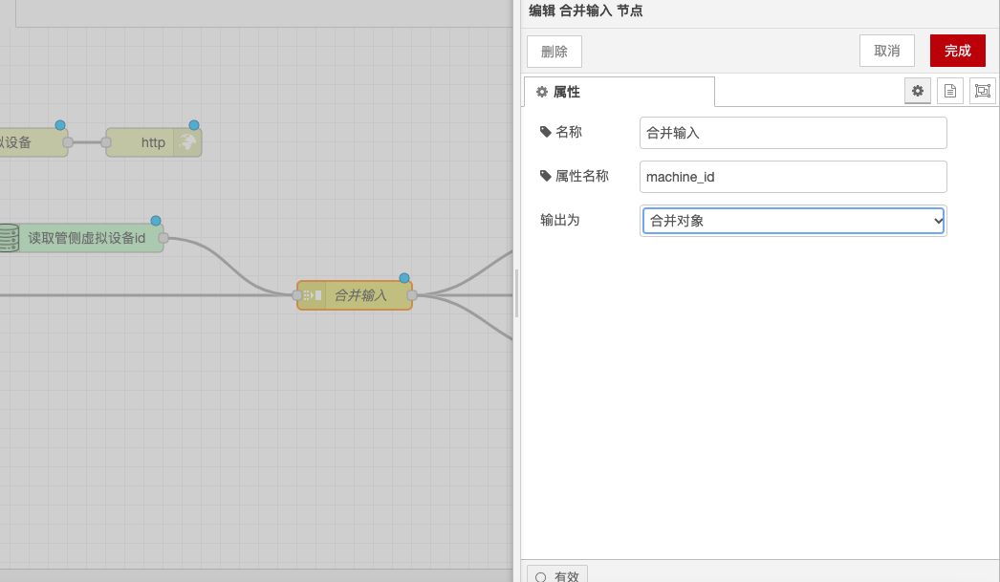

# Join Node

### Function Description

The Join node is used to combine a sequence of messages into a single message. It offers three modes: Automatic mode, Manual mode, and Column Aggregation mode. Below is a detailed description of the functionality and configuration options:

### Modes

#### **Automatic Mode**

* **Function**: When paired with a split node, it will automatically merge the messages that have been split.
* **Input**: When using Automatic mode, all messages should contain the `parts` property. The split node generates this property, but it can also be set manually. This property has the following attributes:
  * `id`: Identifier for the group of messages.
  * `index`: Position within the group.
  * `count`: The total number of messages in the group if known.
  * `type`: The type of the message (string/array/object/buffer).
  * `ch`: For strings or buffers, the data used to split the message into strings or byte arrays.
  * `key`: For objects, the key of the property that created this message.
  * `len`: The length of each sub-message when the message is split using a fixed length value.
  * `complete`: If set, the node will send its output message in its current state.

#### **Manual Mode**

* **Function**: Manually merge a sequence of messages in various ways.
* **Methods**:
  * **String or Buffer**: By concatenating the selected property of each message with a specified join character or buffer.
  * **Array**: By adding each selected property or the entire message to the output array.
  * **Key/Value Object**: By using the properties of each message to determine the key where the desired value is stored.
  * **Merged Object**: By merging the properties of each message under a single object.
* **Other Properties of the Output Message**: Taken from the last message before sending the result.
* **Count**: Determines how many messages should be received to perform the merge.
* **Timeout**: Sets the waiting time before sending a new message.
* **msg.complete**: If a message with the `msg.complete` property set is received, the output message is sent and the message count is reset.
* **msg.reset**: If a message with the `msg.reset` property set is received, the partially received messages are deleted without being sent, and the message count is reset.

#### **Column Aggregation Mode**

* **Function**: Applies an expression to all messages in the message sequence to reduce it to a single message.
* **Initial Value**: The initial value for the accumulated value ($A).
* **Aggregation Expression**: A JSONata expression called for each message in the sequence. The result is passed as the accumulated value to the next call of the expression. The following special variables can be used:
  * `$A`: Accumulated value.
  * `$I`: Index of the message in the sequence.
  * `$N`: Number of messages in the sequence.
* **Final Adjustment Expression**: An optional JSONata expression applied after the aggregation expression has been applied to all messages in the sequence. The following special variables can be used:
  * `$A`: Accumulated value.
  * `$N`: Number of messages in the sequence.
* **Order**: By default, the aggregation expression is applied from the first message to the last message in the sequence. It can also be chosen to apply the aggregation expression in reverse order.

### Example

Given a sequence of numeric values, the following settings will calculate the average:

* **Aggregation Expression**: `$A + payload`
* **Initial Value**: 0
* **Final Adjustment Expression**: `$A / $N`

### Storing Messages

The node will cache messages internally to work across sequences. The runtime setting `nodeMessageBufferMaxLength` can be used to set the number of cached messages.

With the above configurations, you can use the Join node in Node-RED to combine a sequence of messages into a single message, facilitating subsequent processing and analysis.

<figure><figcaption></figcaption></figure>
