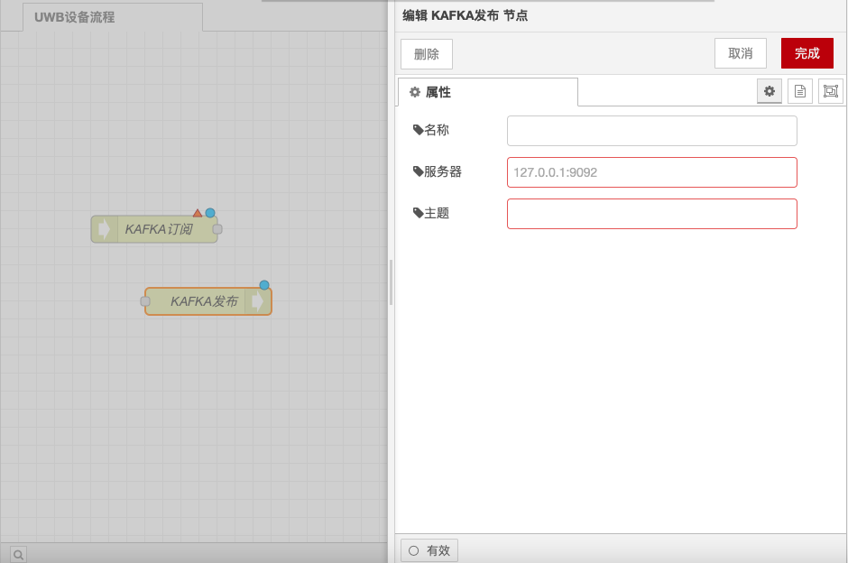
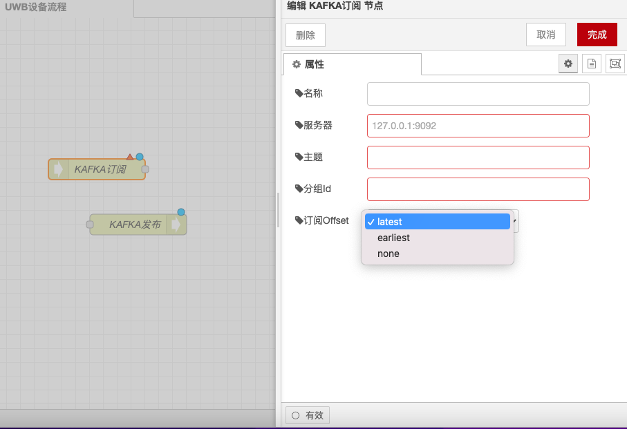

# Kafka Publish and Subscribe Nodes

### Function Description

The Kafka Publish node is used to publish messages to a Kafka topic, while the Kafka Subscribe node is used to subscribe to messages from a Kafka topic. Below is a detailed description of the functionalities and configuration options:

### Kafka Publish Node

#### **Function Description**

* **Connection Acquisition**: The Kafka Publish node first acquires a connection to the Kafka server so that subsequent nodes can use this connection to publish messages.
* **Message Publishing**: After successfully acquiring the connection, the node sends the message to the specified Kafka topic.
* **Failure Handling**: If acquiring the connection or publishing the message fails, the node sends the message to the failure connector for processing.

#### **Configuration Options**

* **Kafka Server Address**: Set the address and port of the Kafka server, such as `localhost:9092`.
* **Topic**: Specify the Kafka topic to which messages are published, such as `my-topic`.
* **Authentication Information** (optional): If the Kafka server requires authentication, you can set the username and password.
* **Message Key** (optional): Specify the key for the message, used for Kafka partitioning.
* **Message Value**: Specify the content of the message to be published.

<figure><figcaption></figcaption></figure>

### Kafka Subscribe Node

#### **Function Description**

* **Connection Acquisition**: The Kafka Subscribe node first acquires a connection to the Kafka server so that subsequent nodes can use this connection to subscribe to messages.
* **Message Subscription**: After successfully acquiring the connection, the node will subscribe to messages from the specified Kafka topic.
* **Failure Handling**: If acquiring the connection or subscribing to messages fails, the node sends the message to the failure connector for processing.

#### **Configuration Options**

* **Kafka Server Address**: Set the address and port of the Kafka server, such as `localhost:9092`.
* **Topic**: Specify the Kafka topic from which messages are subscribed, such as `my-topic`.
* **Authentication Information** (optional): If the Kafka server requires authentication, you can set the username and password.
* **Consumer Group**: Specify the consumer group, used to manage message subscriptions.
* **Offset**: Specify the offset from which to start subscribing to messages, such as `latest` or `earliest`.

<figure><figcaption></figcaption></figure>

With the above configurations, you can use the Kafka Publish and Subscribe nodes in Node-RED to publish and subscribe to messages, and handle possible failure scenarios.
