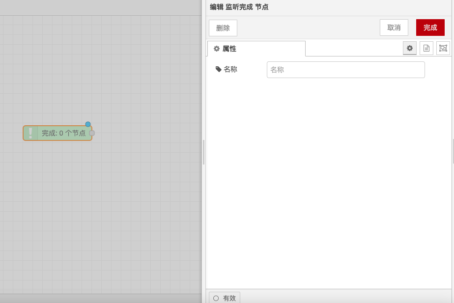

# Listen Complete Node

### **Function Description**

The Listen Complete node is used to trigger a flow when another node has finished processing a message. If a node notifies the runtime that it has completed processing a message, this node can be used to trigger a second flow. This node can be used in conjunction with nodes that do not have output ports, such as triggering a flow after using an email send node to send an email.

### **Detailed Configuration**

* **Trigger Condition**: The Listen Complete node can only be set to handle events from a selected node in the flow. Unlike the Catch node, you cannot specify the "all nodes" mode and target all nodes in the flow.
* **Supported Nodes**: Not all nodes will trigger this event. It depends on whether they support this feature introduced in Node-RED 1.0.

### **Usage Scenarios**

* **Post-Email Sending Processing**: After using an email send node to send an email, trigger a flow to perform subsequent operations such as logging, notifying other systems, etc.
* **Post-File Processing Operations**: After a file processing node completes file processing, trigger a flow to perform file archiving, notifying users, etc.
* **Post-Database Operation Processing**: After a database operation node completes data insertion or update, trigger a flow to perform data synchronization, logging, etc.

### **Notes**

* **Node Support**: Ensure that the selected node supports triggering the completion event, otherwise the Listen Complete node will not work properly.
* **Single Node Listening**: The Listen Complete node can only listen to the completion event of a specific node in the flow, not all nodes' events.
* **Flow Design**: When designing the flow, consider the position and trigger conditions of the Listen Complete node to ensure that the flow executes in the expected order.

Through these configuration options and functionalities, the Listen Complete node can flexibly handle and trigger flows, ensuring that the flows execute according to the predetermined logic.

<figure><figcaption></figcaption></figure>
