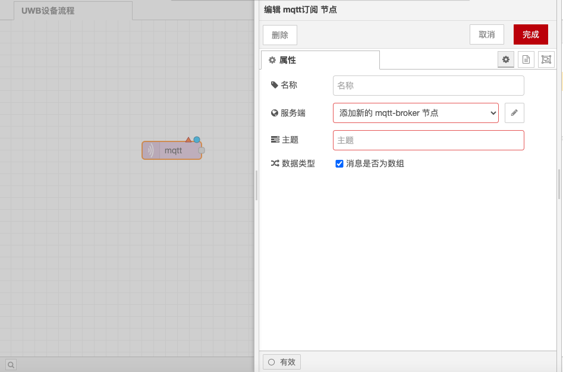
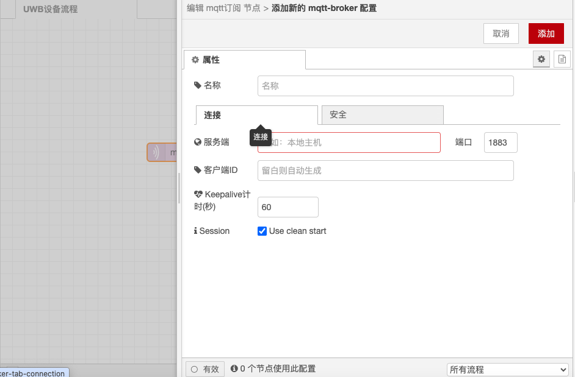
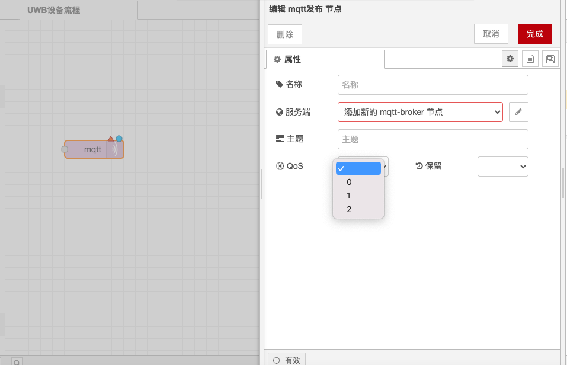
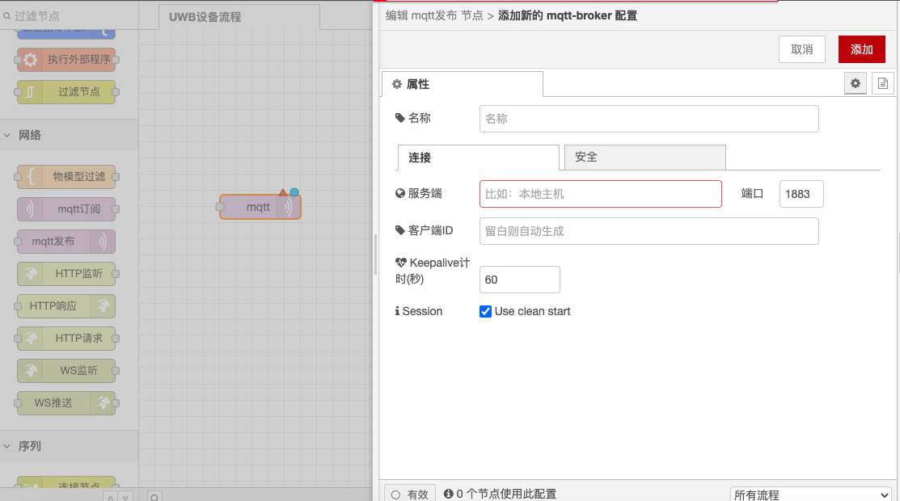

# MQTT Publish and Subscribe Nodes

### Function Description

The MQTT Subscribe node is used to connect to an MQTT broker and subscribe to messages from specified topics, while the MQTT Publish node is used to connect to an MQTT broker and publish messages. Below are detailed function descriptions and configuration options:

### MQTT Subscribe Node

#### **Function Description**

* **Connect to MQTT Broker**: The MQTT Subscribe node connects to the MQTT broker and subscribes to messages from specified topics.
* **Output**:
  * **payload**: String or buffer, it is a string unless it is a binary buffer.
  * **topic**: String, the MQTT topic, using `/` as the hierarchy separator.
  * **qos**: Numeric, QoS service quality: 0 (at most once), 1 (at least once), 2 (exactly once).
  * **retain**: Boolean, true if the message is retained and may be old.

#### **Configuration Options**

* **MQTT Broker Address**: Set the address and port of the MQTT broker, such as `mqtt://localhost:1883`.
* **Subscribe Topic**: Specify the MQTT topic to subscribe to, which can include MQTT wildcards (+: one level, #: multiple levels).
* **QoS**: Set the QoS level for the subscription.

<figure><figcaption></figcaption></figure>

<figure><figcaption></figcaption></figure>

### MQTT Publish Node

#### **Function Description**

* **Connect to MQTT Broker**: The MQTT Publish node connects to the MQTT broker and publishes messages.
* **Input**:
  * **payload**: String or buffer, the payload to be published. If this property is not set, no message will be sent. To send a blank message, set this property to an empty string.
  * **topic**: String, the MQTT topic to publish to.
  * **qos**: Numeric, QoS service quality: 0 (at most once), 1 (at least once), 2 (exactly once). The default value is 0.
  * **retain**: Boolean, set to true to retain the message on the broker. The default value is false.

#### **Configuration Options**

* **MQTT Broker Address**: Set the address and port of the MQTT broker, such as `mqtt://localhost:1883`.
* **Publish Topic**: Specify the MQTT topic to publish to.
* **QoS**: Set the QoS level for publishing.
* **retain**: Set whether to retain the message.

<figure><figcaption></figcaption></figure>

<figure><figcaption></figcaption></figure>

With the above configurations, you can use the MQTT Subscribe and Publish nodes in Node-RED to subscribe to and publish messages, and handle possible failure scenarios.
