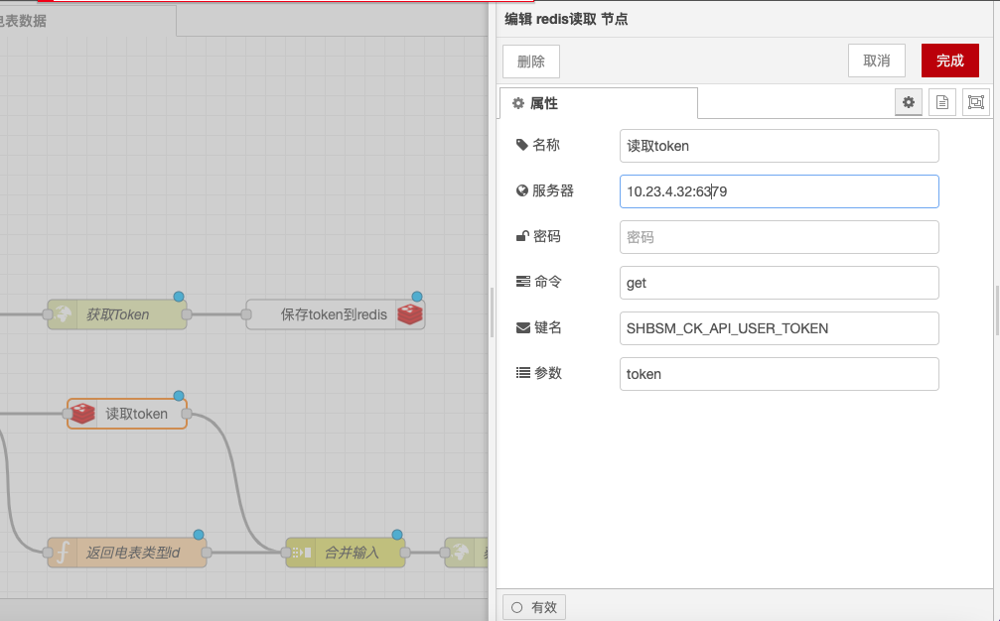
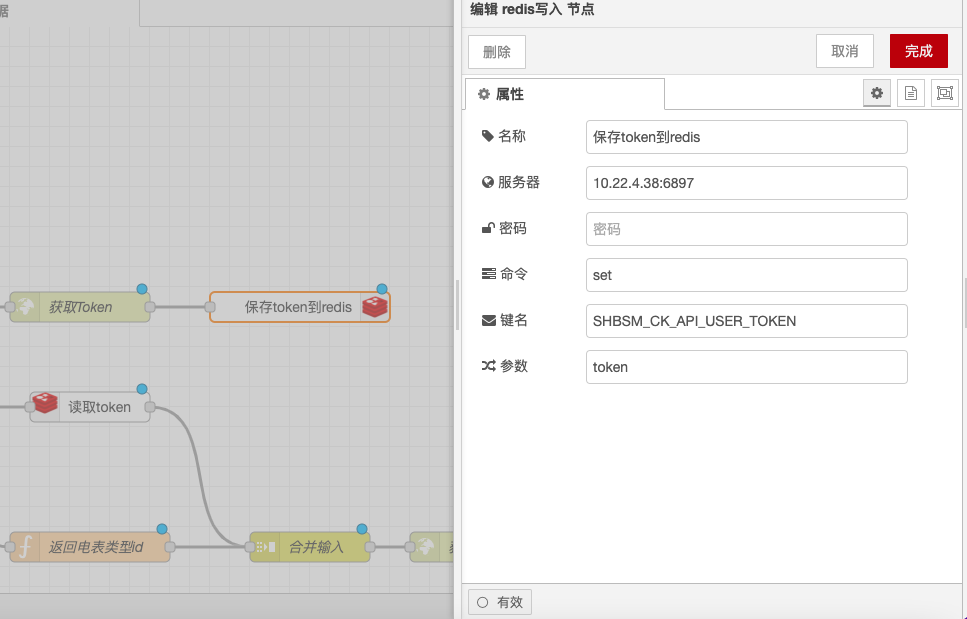

# Redis Read and Write Nodes

### Function Description

The Redis Read node (Redis in) and Redis Write node (Redis out) are used to interact with a Redis database in Node-RED. Below is a detailed description of the functionalities and configuration options:

### Redis Read Node (Redis in)

#### **Function Description**

* **Subscription Functionality**: The Redis Read node acts as a subscriber and can read data from Redis using BLPOP, SUBSCRIBE, or PSUBSCRIBE methods.
* **Topic Pattern**: `msg.topic` is the topic pattern for all methods, with multiple topics separated by spaces.
* **Pattern Support**: Only the PSUBSCRIBE method supports patterns with wildcards.

#### **Configuration Options**

* **Redis Server Address**: Set the address and port of the Redis server, such as `localhost:6379`.
* **Authentication Information** (optional): If the Redis server requires authentication, you can set the password.
* **Subscription Method**: Choose between BLPOP, SUBSCRIBE, or PSUBSCRIBE.
* **Topic Pattern**: Set the topic or pattern to subscribe to.

<figure><figcaption></figcaption></figure>

### Redis Write Node (Redis out)

#### **Function Description**

* **Publish Functionality**: The Redis Write node acts as a publisher and can write data to Redis using RPUSH, LPUSH, or PUBLISH methods.
* **Topic Key Name**: `msg.topic` is the key name for the data to be published.
* **Output Result**: Only the PUBLISH method returns the number of subscribers.

#### **Configuration Options**

* **Redis Server Address**: Set the address and port of the Redis server, such as `localhost:6379`.
* **Authentication Information** (optional): If the Redis server requires authentication, you can set the password.
* **Publish Method**: Choose between RPUSH, LPUSH, or PUBLISH.
* **Topic Key Name**: Set the key name for the data to be published.

<figure><figcaption></figcaption></figure>

With the above configurations, you can use the Redis Read and Write nodes in Node-RED to read and write data, and handle possible failure scenarios.
