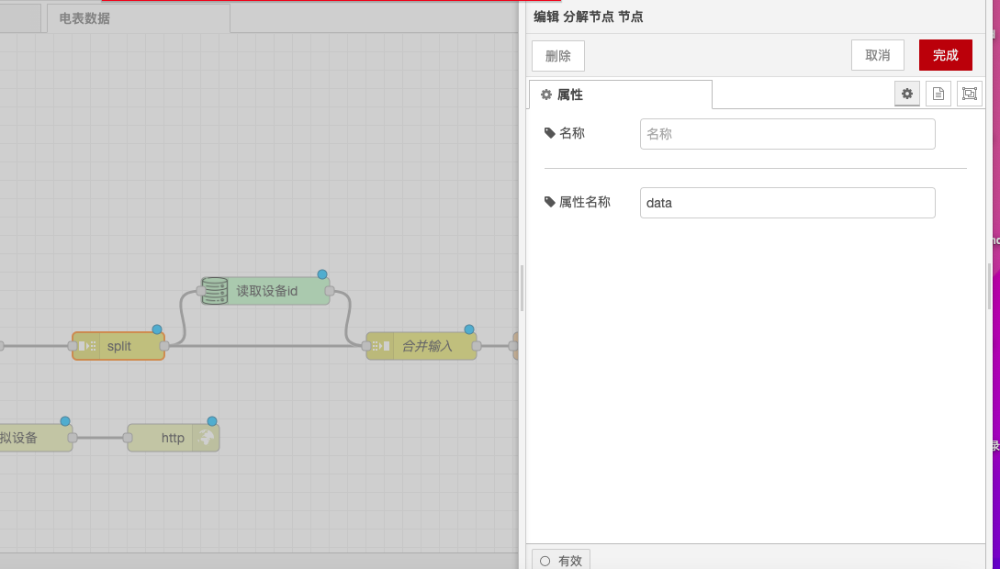

# Split Node

### Function Description

* **Input Type**: The behavior of the node is determined by the type of `msg.payload`:
  * **String/Buffer**: Splits the message using a specified character (default: \n), buffer sequence, or fixed length.
  * **Array**: The message is split into individual array elements or arrays of fixed length.
  * **Object**: A message will be sent for each key/value pair of the object.

### Output

* **parts**: This property contains information on how the message was split from the original message. If passed to a join node, the sequence can be recombined into a single message. The property has the following attributes:
  * **id**: An identifier for a set of messages.
  * **index**: The position within the group.
  * **count**: The total number of messages in the group if known. See "Streaming Mode" below.
  * **type**: The type of the message (string/array/object/buffer).
  * **ch**: For strings or buffers, the data used to split the message into strings or byte arrays.
  * **key**: For objects, the key of the property that created this message. The node can be configured to also copy this value to another message property, such as `msg.topic`.
  * **len**: The length of each sub-message when the message is split using a fixed length value.

### Details

* **Sequence Recombination**: It is recommended to use this node to easily create cross-message sequences and perform common operations before recombining the sequence into a single message using a join node.
* **msg.parts Property**: It uses the `msg.parts` property to track the individual parts of the sequence.
* **Streaming Mode**: This node can also be used to reorder message streams. For example, a serial device that sends newline-terminated commands might pass a message with a partial command at the end. In "Streaming Mode," this node will split a message and send each complete segment. If there is a partial fragment at the end, the node will hold onto it and prepend it to the next message received.
* **Count Property in Streaming Mode**: When running in this mode, the node will not set the `msg.parts.count` property because the number of expected messages in the stream is still unknown. This means it cannot be used with a join node in automatic mode.

With the above configurations, you can use the Split node in Node-RED to split messages into a series of messages and process their outputs.

<figure><figcaption></figcaption></figure>
