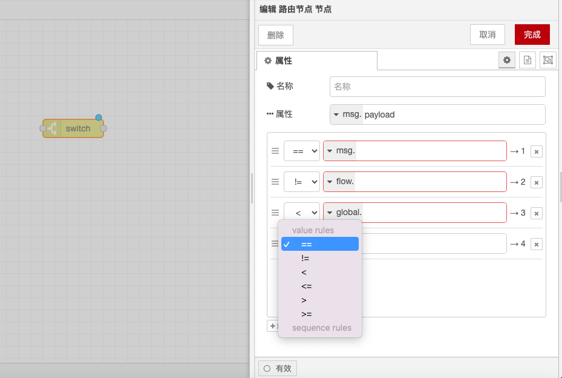

# Switch Node

### **Function Description**

The Switch node is used to route messages based on the value of message properties. It evaluates specified rules against the received message and then sends the message to the output port corresponding to the matching rule.

### **Configuration Options**

* **Stop Further Matching**: The node can be set to stop further matching once a matching rule is found.
* **Evaluation Rules**: Rules can be defined using message properties, flow context/global context properties, environment variables, and the evaluation results of JSONata expressions.

### **Rule Types**

The Switch node supports the following four rule types:

1. **Value Evaluation Rule**: Evaluates rules based on configured properties.
2. **Sequence Rule**: Used for message sequences, such as those generated by the "Split" node.
3. **JSONata Expression Rule**: Evaluates the entire message, and if the result is true, it matches.
4. **Default Rule**: Applies when none of the above rules match.

### **Rule Matching Details**

* **is true/false Rule**: Performs a strict type match, with no type conversion occurring before the match.
* **is null Rule**: Performs a strict type match, with no type conversion occurring before the match.
* **is empty Rule**: Matches zero-byte strings, arrays, buffers, or objects without properties, and does not match null or undefined.

### **Handling Message Sequences**

* **Default Behavior**: The node does not modify the `msg.parts` property.
* **Rebuild Message Sequence Option**: This option can be enabled to generate a new message sequence for each matching rule. In this mode, the node will cache the entire incoming sequence before sending a new sequence.
* **Message Caching Limit**: The runtime setting `nodeMessageBufferMaxLength` can be used to limit the number of messages that can be cached.

With these configuration options and rule types, the Switch node can flexibly handle and distribute messages, ensuring that messages are correctly routed to the appropriate output ports according to the predetermined rules.

<figure><figcaption></figcaption></figure>
