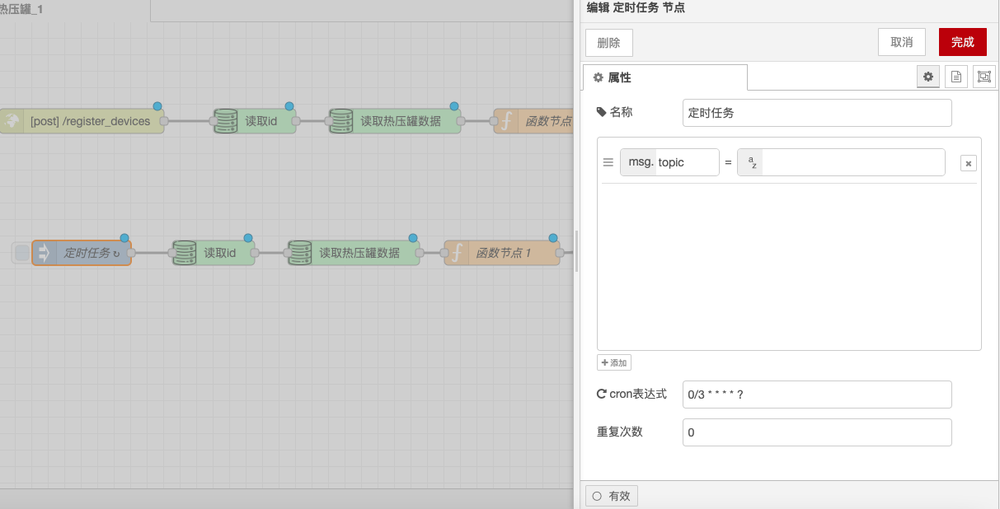

# Timer Task Node

### **Function Description**

The Timer Task node is used to manually or periodically inject messages into the flow. The payload of the message can be of various types, including strings, JavaScript objects, or the current time.

### **Output**

* **payload**: The specified payload of the message, which can be a string, number, boolean, JavaScript object, or a value from the flow/global context.
* **topic**: An optional property that can be configured in the node to specify the topic of the message.

### **Details**

* **Default Payload**: By default, the node injects the current timestamp (in milliseconds since January 1, 1970).
* **Manual Trigger**: By default, the node can be manually triggered by clicking the node button in the editor.
* **Periodic or Scheduled Injection**: The node can also be set to inject messages periodically or according to a schedule.
* **One-Time Injection**: Another optional setting is to inject a message once every time the flow starts.
* **Maximum Interval**: The maximum interval that can be specified is approximately 596 hours/24 days. For intervals longer than a day, it is recommended to use the scheduler node to handle power outages or restarts.

### **Notes**

* **Time Interval and Specific Time**: The options "time interval" and "specific time" use the standard cron system. This means "20 minutes" does not mean 20 minutes from now, but rather at 20 minutes and 40 minutes past every hour. If you want to set it to every 20 minutes from now, then use the "interval" option.
* **Newline Characters**: If you want to include newline characters in a string, you must use a "function" node to create the payload.

With these configuration options, the Timer Task node can flexibly control the injection time and frequency of messages, ensuring that the flow is triggered and executed according to the predetermined schedule.

<figure><figcaption></figcaption></figure>
