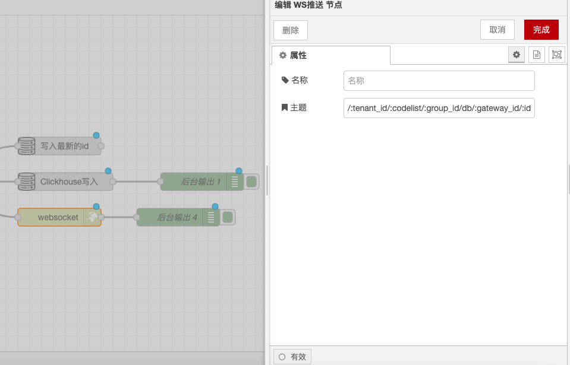

# WebSocket Push Node

### **Function Description**

The WebSocket Output Node is used to send messages via WebSocket. By default, `msg.payload` will be sent through the WebSocket. Users can configure the socket to encode the entire `msg` object as a JSON string and then send it through the WebSocket.

### **Configuration Options**

* **Message Content**: By default, `msg.payload` is sent. The node can be configured to send the entire `msg` object encoded as a JSON string.
* **Target Client**: If the message originates from a WebSocket In node, it will be sent back to the client that triggered the flow. Otherwise, the message will be broadcast to all connected clients.
* **Topic**: The message's topic can be specified via the `msg.topic` property, allowing clients to filter and process messages based on the topic.

### **Detailed Configuration**

* **Send Entire `msg` Object**:
  * In the node configuration, you can choose to encode the entire `msg` object as a JSON string and send it.
  * This ensures that all message properties are included in the sent data.
* **Broadcast Message**:
  * If you need to broadcast messages that start from a WebSocket In node, you should remove the `msg._session` property from the flow.
  * Removing the `msg._session` property will broadcast the message to all connected clients instead of sending it back only to the client that triggered the flow.
* **Topic**:
  * The message's topic can be specified via the `msg.topic` property.
  * Clients can filter and process messages based on the topic, enabling more flexible message routing and processing.

### **Examples**

*   **Send `msg.payload`**:

    ```json
    {
      "payload": "Hello, World!"
    }
    ```
*   **Send Entire `msg` Object**:

    ```json
    {
      "topic": "example",
      "payload": {
        "message": "Hello, World!"
      }
    }
    ```
*   **Specify Topic**:

    ```json
    {
      "topic": "news",
      "payload": {
        "headline": "Breaking News",
        "content": "Something important happened."
      }
    }
    ```

### **Use Cases**

* **Real-time Communication**: In real-time communication applications, the WebSocket Output Node is used to send real-time data to clients.
* **State Updates**: In state update applications, the WebSocket Output Node is used to broadcast state updates to all connected clients.
* **Event Notifications**: In event notification systems, the WebSocket Output Node is used to send event notifications to specific clients or all clients.
* **Topic Filtering**: In applications that require message filtering based on topics, the WebSocket Output Node is used to send messages with topics.

### **Notes**

* **Message Size**: Ensure that the size of the sent message is within the limits of the WebSocket protocol.
* **Security**: When sending sensitive information, ensure proper encryption and authentication are in place.
* **Performance Optimization**: When handling a large number of concurrent connections, consider using appropriate WebSocket server configurations and optimizations.
* **Topic Consistency**: Ensure that clients and server-side definitions and processing of topics are consistent to avoid message routing errors.

With these configuration options and functionalities, the WebSocket Output Node can flexibly handle and send WebSocket messages, ensuring that clients can receive and process data in real-time.

<figure><figcaption></figcaption></figure>
