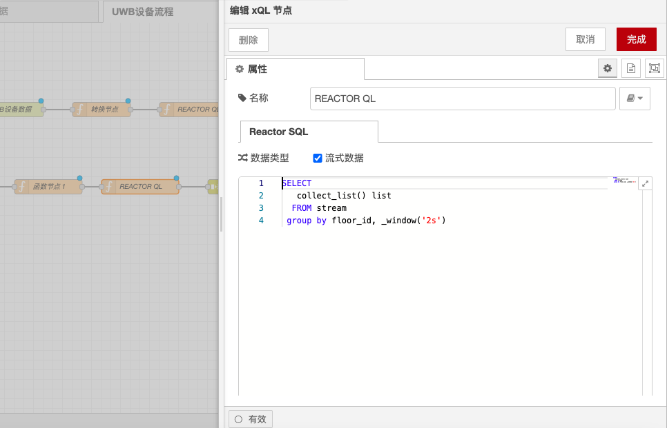

# xQL Node

### **Function Description**

The xQL node supports filtering or aggregating streaming data using SQL statements and can perform fuzzy filtering based on topics. Since data continuously flows in, the aggregation functions executed must have corresponding grouping operations; otherwise, the xQL execution will not return results.

### **Notes**

* **Grouping Operations**: Due to the continuous inflow of data, aggregation functions must have corresponding grouping operations; otherwise, the xQL execution will not return results.
  *   For example, the following aggregation function will not return results because no grouping condition is specified:

      ```sql
      SELECT * FROM "neuron/1/2/+/properties"
      ```
  *   The following SQL statement can execute smoothly because it specifies a window function:

      ```sql
      SELECT count(intVal) total, sum(intVal) sum FROM "neuron/1/2/+/properties" GROUP BY _window('500ms');
      ```
  *   The following SQL statement can also execute because data continuously flows in:

      ```sql
      SELECT * FROM "neuron/1/2/+/properties"
      ```

### **Configuration Steps**

1. **Double-click the function node**:
   * A pop-up window will appear where you can fill in the node name (optional) and the SQL statement.
2. **Fill in the SQL statement**:
   * Fill in the required SQL statement in the pop-up window, ensuring it includes necessary grouping operations.
3. **Click the complete button**:
   * After filling in, click the complete button in the pop-up window to save the configuration.

### **Examples**

*   **Aggregation Function Example**:

    ```sql
    SELECT count(intVal) total, sum(intVal) sum FROM "neuron/1/2/+/properties" GROUP BY _window('500ms');
    ```
*   **Filtering Data Example**:

    ```sql
    SELECT * FROM "neuron/1/2/+/properties" WHERE intVal > 100;
    ```

### **Use Cases**

* **Data Aggregation**: In scenarios where aggregation calculations (such as counting, summing, etc.) on streaming data are needed, use the xQL node for data aggregation.
* **Data Filtering**: In scenarios where filtering streaming data based on conditions is needed, use the xQL node for data filtering.
* **Real-time Analysis**: In real-time data analysis applications, use the xQL node for real-time data processing and analysis.

### **Notes**

* **Grouping Operations**: Ensure that necessary grouping operations are included in aggregation functions to avoid execution without returning results.
* **SQL Statements**: Ensure that SQL statements are correct and comply with xQL syntax requirements.
* **Performance Optimization**: When processing large amounts of data, consider performance optimization, such as setting window sizes reasonably and optimizing SQL queries.

With these configuration options and functionalities, the xQL node can flexibly process and manipulate streaming data, ensuring that streaming data is filtered and aggregated according to the predefined logic.

<figure><figcaption></figcaption></figure>
