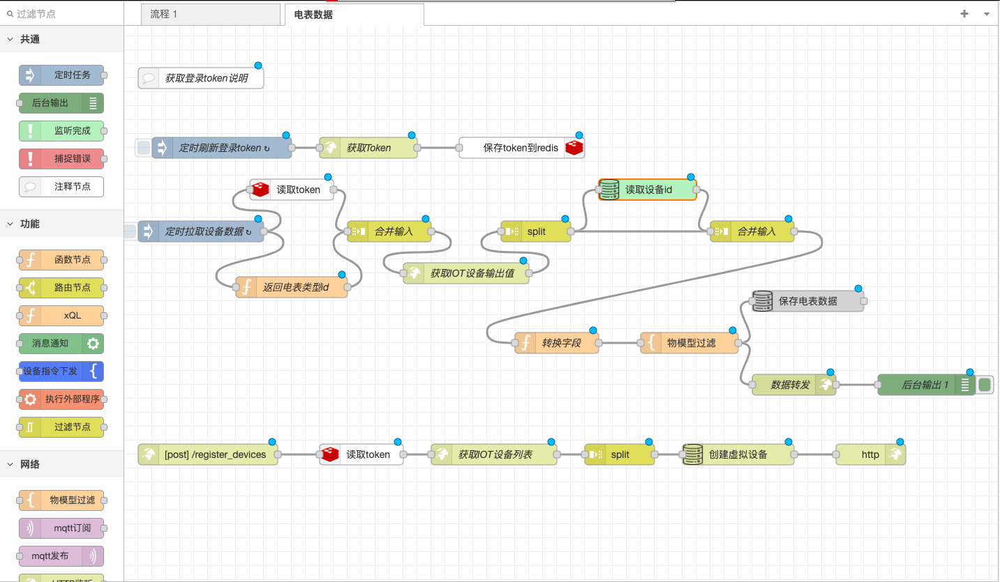
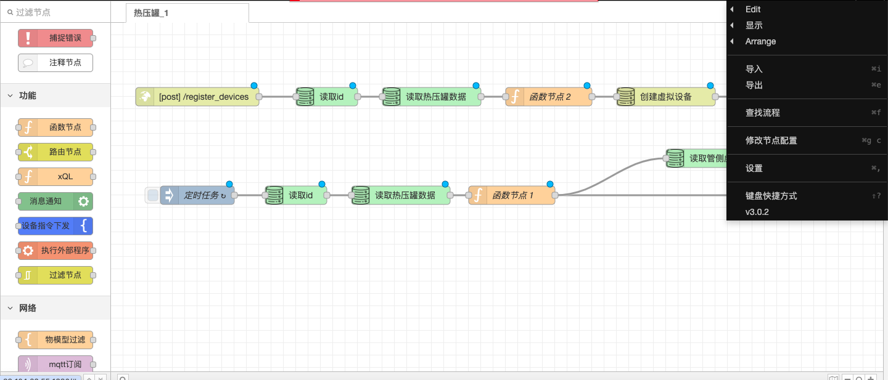
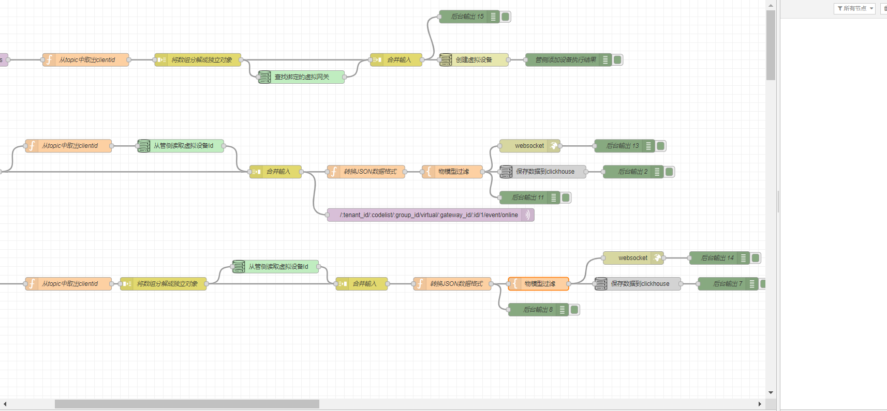

# 2.5.5 Example Flows

### API Access Flow Steps

1. **Add HTTP Input Node**:
   * Drag an HTTP input node from the node palette to the workspace.
   * Double-click the node to configure it, setting the listening URL path, for example, `/api`.
2. **Add Function Node**:
   * Drag a function node to the workspace and connect it to the HTTP input node.
   * Write JavaScript code in the function node to process the received HTTP request data.
3. **Add HTTP Response Node**:
   * Drag an HTTP response node to the workspace and connect it to the function node.
   * Configure the HTTP response node to ensure it correctly returns the processed data to the client.

<figure><figcaption></figcaption></figure>

### Database Access Flow Steps

1. **Install Database Nodes**:
   * Install the nodes for your database type via Node-RED's library manager, such as `node-red-node-mysql` or `node-red-node-postgresql`.
2. **Add Database Node**:
   * Drag a database node (like MySQL or PostgreSQL node) from the node palette to the workspace.
   * Double-click the node to configure it, entering the database connection information such as hostname, port, database name, username, and password.
3. **Connect Database Node**:
   * Connect the database node to your flow, for example, from an HTTP input node or other trigger nodes to the database node.
   * Configure the database node's SQL query or update statement to perform the desired database operations.

<figure><figcaption></figcaption></figure>

### MQTT Message Access Flow Steps

1. **Add MQTT Input Node**:
   * Drag an MQTT input node from the node palette to the workspace.
   * Double-click the node to configure it, entering the MQTT broker's address and port, and the topic you want to subscribe to, such as `/mqtt/+/register_devices`.
2. **Add Function Node**:
   * Drag a function node to the workspace and connect it to the MQTT input node.
   * Write JavaScript code in the function node to process the received MQTT message, for example, extracting the `clientid` or other necessary information.
3. **Add Other Processing Nodes**:
   * Add other nodes as needed, such as split nodes, JDBC read nodes, join input nodes, etc., to further process and manipulate the MQTT message.
4. **Add MQTT Output Node** (if needed to send messages):
   * Drag an MQTT output node to the workspace and configure its connection and topic information.
   * Connect the MQTT output node to the appropriate nodes to send processed messages to the MQTT broker.

<figure><figcaption></figcaption></figure>

With these steps, you can create a complete flow in Node-RED that includes API access, database operations, and MQTT message processing. Each node supports specific functionality through configuration and function writing.
