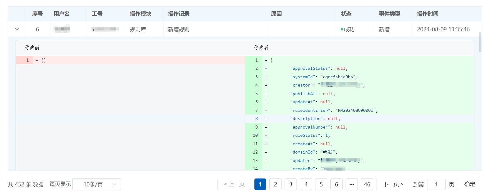
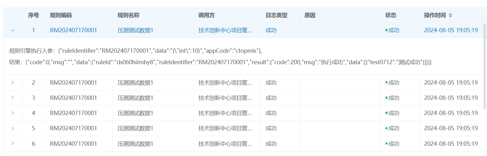

# 2.3.4 Log Management

### Overview

Rule Log Management is a critical feature within the Rule Engine, responsible for recording and tracking the execution history and status of rules. Through rule logs, users can monitor the operation of rules, troubleshoot issues, optimize performance, and ensure the transparency and traceability of business processes. The Rule Log Management module typically includes functionalities such as log recording and querying, helping users gain a comprehensive understanding of the Rule Engine's operational status.

### Core Features

#### **1. Log Recording**

* **Detailed Recording**: The Rule Log Management module records in detail each rule's execution, including the trigger time, execution result, and involved data.
* **Multi-Dimensional Recording**: Supports logging by multiple dimensions such as rule name, execution time, user, and business process, facilitating subsequent queries and analysis.

#### **2. Log Querying**

* **Flexible Querying**: Offers powerful querying capabilities, allowing users to quickly retrieve logs based on different criteria such as time range, rule name, execution result, etc.
* **Real-Time Querying**: Supports real-time querying of the latest log entries, ensuring users can promptly obtain the most recent information on rule execution.

<figure><figcaption></figcaption></figure>

<figure><figcaption></figcaption></figure>

Through the Rule Log Management feature, the Rule Engine not only enhances the system's transparency and maintainability but also provides users with powerful tools to monitor and optimize business processes. This functionality is a key component in ensuring the Rule Engine operates efficiently and stably.
